# Sequence Diagrams — FULL
# Sistem POS Modular Berbasis Monolith
 
> **Versi:** 2.1 (Full, Consolidated — Online Web App)
> Mengacu pada: `srs-pos-monolith.md` (v2.1), `prd-pos-monolith.md` (v2.1), `backend-spec-pos-monolith.md`
> Notasi: Mermaid `sequenceDiagram` (dapat dirender langsung di GitHub/editor Markdown)
>
> Komponen yang terlibat (modul dalam monolith):
> - **POS Web** : front-end kasir (SvelteKit, online) | **Admin Dashboard** : back-office
> - **API Layer** : pengganti API Gateway (auth, routing, RBAC)
> - **Auth** : autentikasi & otorisasi | **Business** : multi-business & settings
> - **Sales** : Checkout | **Pricing** : Promotion & Voucher | **Inventory** : stok & katalog
> - **Customer** : CRM & Loyalty | **Booking** : reservasi & DP | **Purchasing** : pembelian
> - **Contact** : supplier/customer | **HRM** : staf/expense/komisi | **Accounting** : payment account
> - **CashControl** : shift/kas | **Reporting** : laporan
> - **EventBus** : Domain Events in-process | **JobQueue** : Redis background queue
> - **WS** : WebSocket Gateway | **DB** : PostgreSQL
 
---
 
## Daftar Isi
 
**A. Autentikasi & Konteks**
1. Login & RBAC
2. Pemilihan Business / Lokasi (Tenant Context)
 
**B. Penjualan & Kasir**
3. Checkout Split Payment + Voucher
4. Validasi & Redemption Voucher (anti pemakaian ganda)
5. Put On Hold (Parkir Tagihan)
5A. Tab Transaksi Multi-Pelanggan (Hold tetap di Tab, maks 10)
6. Cash Control: Buka & Tutup Shift
7. Penjualan Kredit/Partial + Payment Reminder
8. Sales Return
9. Penjualan dengan Commission Agent
10. Cetak Struk ESC/POS + Cash Drawer
 
**C. Loyalty, Promo & Voucher**
11. Loyalty Points: Perolehan & Penukaran
12. Penerapan Diskon Bersyarat & Price Markdown
13. Generate Voucher Batch (Admin)
 
**D. Produk & Stok**
14. Buat Produk Variable & Import CSV
15. Cetak Barcode & Label
16. Real-time Stock Checking Antar Cabang
17. Stock Adjustment
18. Stock Transfer (In Transit -> Completed)
19. Alert Low Stock & Expiry (Background Job)
 
**E. Pembelian & Kontak**
20. Pembelian (Purchase) & Penerimaan Stok
21. Purchase Return
22. Pembayaran Supplier & Contact Ledger
 
**F. Booking**
23. Reservasi Meja/Staf + Pemantauan Kalender
24. Pre-Order / Click & Collect (Stock Hold)
25. Booking dengan Deposit (DP) & Pelunasan
 
**G. Scan**
26. Scan Barcode via Smartphone (Opsi A)
 
**H. Keuangan & Laporan**
27. Pencatatan Pengeluaran (Expense)
28. Posting ke Payment Account & Cash Flow
29. Generate Laporan (Background Job)
 
**I. Administrasi Pengguna**
30. Manajemen User, Role & Permission (User Matrix)
 
---
 
# A. Autentikasi & Konteks
 
## 1. Login & RBAC
 
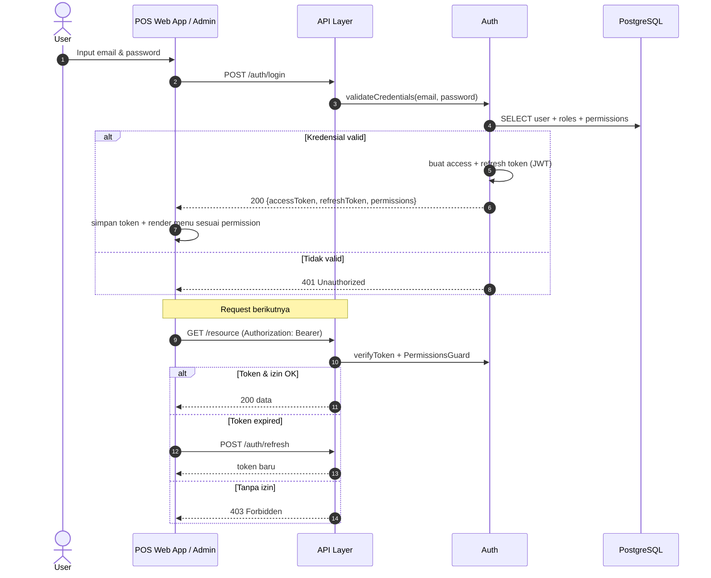
```mermaid
sequenceDiagram
    autonumber
    actor User
    participant POS as POS Web App / Admin
    participant API as API Layer
    participant AUT as Auth
    participant DB as PostgreSQL
 
    User->>POS: Input email & password
    POS->>API: POST /auth/login
    API->>AUT: validateCredentials(email, password)
    AUT->>DB: SELECT user + roles + permissions
    alt Kredensial valid
        AUT->>AUT: buat access + refresh token (JWT)
        AUT-->>POS: 200 {accessToken, refreshToken, permissions}
        POS->>POS: simpan token + render menu sesuai permission
    else Tidak valid
        AUT-->>POS: 401 Unauthorized
    end
 
    Note over POS,API: Request berikutnya
    POS->>API: GET /resource (Authorization: Bearer)
    API->>AUT: verifyToken + PermissionsGuard
    alt Token & izin OK
        API-->>POS: 200 data
    else Token expired
        POS->>API: POST /auth/refresh
        API-->>POS: token baru
    else Tanpa izin
        API-->>POS: 403 Forbidden
    end
```
 
---
 
## 2. Pemilihan Business / Lokasi (Tenant Context)
 
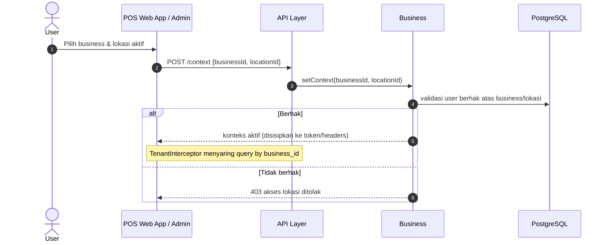
```mermaid
sequenceDiagram
    autonumber
    actor User
    participant POS as POS Web App / Admin
    participant API as API Layer
    participant BIZ as Business
    participant DB as PostgreSQL
 
    User->>POS: Pilih business & lokasi aktif
    POS->>API: POST /context {businessId, locationId}
    API->>BIZ: setContext(businessId, locationId)
    BIZ->>DB: validasi user berhak atas business/lokasi
    alt Berhak
        BIZ-->>POS: konteks aktif (disisipkan ke token/headers)
        Note over POS,API: TenantInterceptor menyaring query by business_id
    else Tidak berhak
        BIZ-->>POS: 403 akses lokasi ditolak
    end
```
 
---
 
# B. Penjualan & Kasir
 
## 3. Checkout dengan Split Payment + Voucher
 
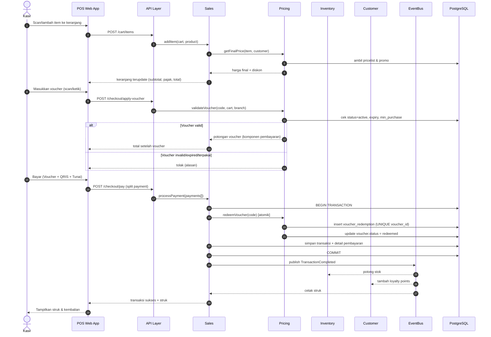
```mermaid
sequenceDiagram
    autonumber
    actor Kasir
    participant POS as POS Web App
    participant API as API Layer
    participant SAL as Sales
    participant PRC as Pricing
    participant INV as Inventory
    participant CUS as Customer
    participant BUS as EventBus
    participant DB as PostgreSQL
 
    Kasir->>POS: Scan/tambah item ke keranjang
    POS->>API: POST /cart/items
    API->>SAL: addItem(cart, product)
    SAL->>PRC: getFinalPrice(item, customer)
    PRC->>DB: ambil pricelist & promo
    PRC-->>SAL: harga final + diskon
    SAL-->>POS: keranjang terupdate (subtotal, pajak, total)
 
    Kasir->>POS: Masukkan voucher (scan/ketik)
    POS->>API: POST /checkout/apply-voucher
    API->>PRC: validateVoucher(code, cart, branch)
    PRC->>DB: cek status=active, expiry, min_purchase
    alt Voucher valid
        PRC-->>SAL: potongan voucher (komponen pembayaran)
        SAL-->>POS: total setelah voucher
    else Voucher invalid/expired/terpakai
        PRC-->>POS: tolak (alasan)
    end
 
    Kasir->>POS: Bayar (Voucher + QRIS + Tunai)
    POS->>API: POST /checkout/pay (split payment)
    API->>SAL: processPayment(payments[])
    SAL->>DB: BEGIN TRANSACTION
    SAL->>PRC: redeemVoucher(code) [atomik]
    PRC->>DB: insert voucher_redemption (UNIQUE voucher_id)
    PRC->>DB: update voucher.status = redeemed
    SAL->>DB: simpan transaksi + detail pembayaran
    SAL->>DB: COMMIT
    SAL->>BUS: publish TransactionCompleted
    BUS-->>INV: potong stok
    BUS-->>CUS: tambah loyalty points
    BUS-->>SAL: cetak struk
    SAL-->>POS: transaksi sukses + struk
    POS-->>Kasir: Tampilkan struk & kembalian
```
 
---
 
## 4. Validasi & Redemption Voucher (Anti Pemakaian Ganda)
 
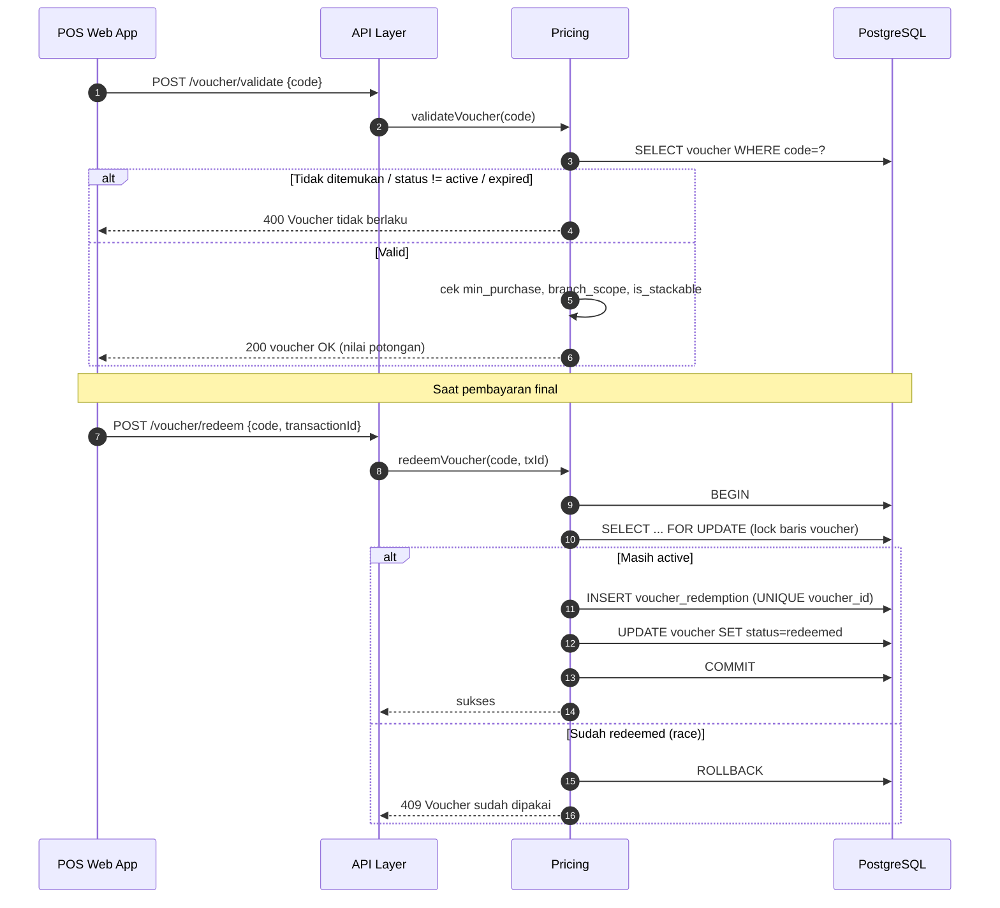
```mermaid
sequenceDiagram
    autonumber
    participant POS as POS Web App
    participant API as API Layer
    participant PRC as Pricing
    participant DB as PostgreSQL
 
    POS->>API: POST /voucher/validate {code}
    API->>PRC: validateVoucher(code)
    PRC->>DB: SELECT voucher WHERE code=?
    alt Tidak ditemukan / status != active / expired
        PRC-->>POS: 400 Voucher tidak berlaku
    else Valid
        PRC->>PRC: cek min_purchase, branch_scope, is_stackable
        PRC-->>POS: 200 voucher OK (nilai potongan)
    end
 
    Note over POS,DB: Saat pembayaran final
    POS->>API: POST /voucher/redeem {code, transactionId}
    API->>PRC: redeemVoucher(code, txId)
    PRC->>DB: BEGIN
    PRC->>DB: SELECT ... FOR UPDATE (lock baris voucher)
    alt Masih active
        PRC->>DB: INSERT voucher_redemption (UNIQUE voucher_id)
        PRC->>DB: UPDATE voucher SET status=redeemed
        PRC->>DB: COMMIT
        PRC-->>API: sukses
    else Sudah redeemed (race)
        PRC->>DB: ROLLBACK
        PRC-->>API: 409 Voucher sudah dipakai
    end
```
 
---
 
## 5. Put On Hold (Parkir Tagihan)
 
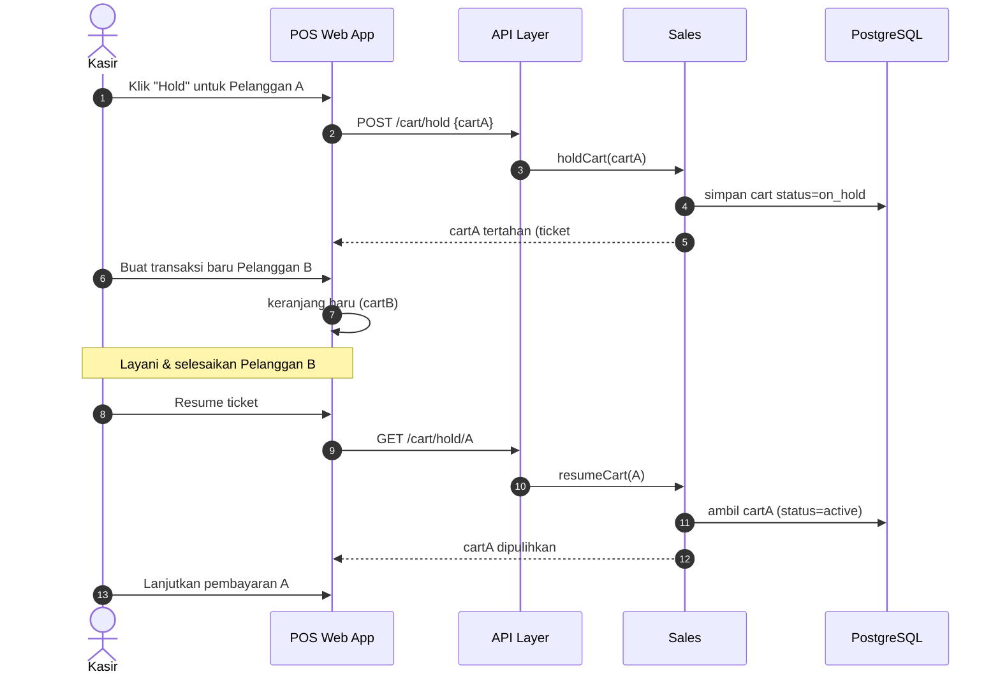
```mermaid
sequenceDiagram
    autonumber
    actor Kasir
    participant POS as POS Web App
    participant API as API Layer
    participant SAL as Sales
    participant DB as PostgreSQL
 
    Kasir->>POS: Klik "Hold" untuk Pelanggan A
    POS->>API: POST /cart/hold {cartA}
    API->>SAL: holdCart(cartA)
    SAL->>DB: simpan cart status=on_hold
    SAL-->>POS: cartA tertahan (ticket #A)
 
    Kasir->>POS: Buat transaksi baru Pelanggan B
    POS->>POS: keranjang baru (cartB)
    Note over Kasir,POS: Layani & selesaikan Pelanggan B
 
    Kasir->>POS: Resume ticket #A
    POS->>API: GET /cart/hold/A
    API->>SAL: resumeCart(A)
    SAL->>DB: ambil cartA (status=active)
    SAL-->>POS: cartA dipulihkan
    Kasir->>POS: Lanjutkan pembayaran A
```
 
---
 
## 5A. Tab Transaksi Multi-Pelanggan (Hold Tetap di Tab)
 
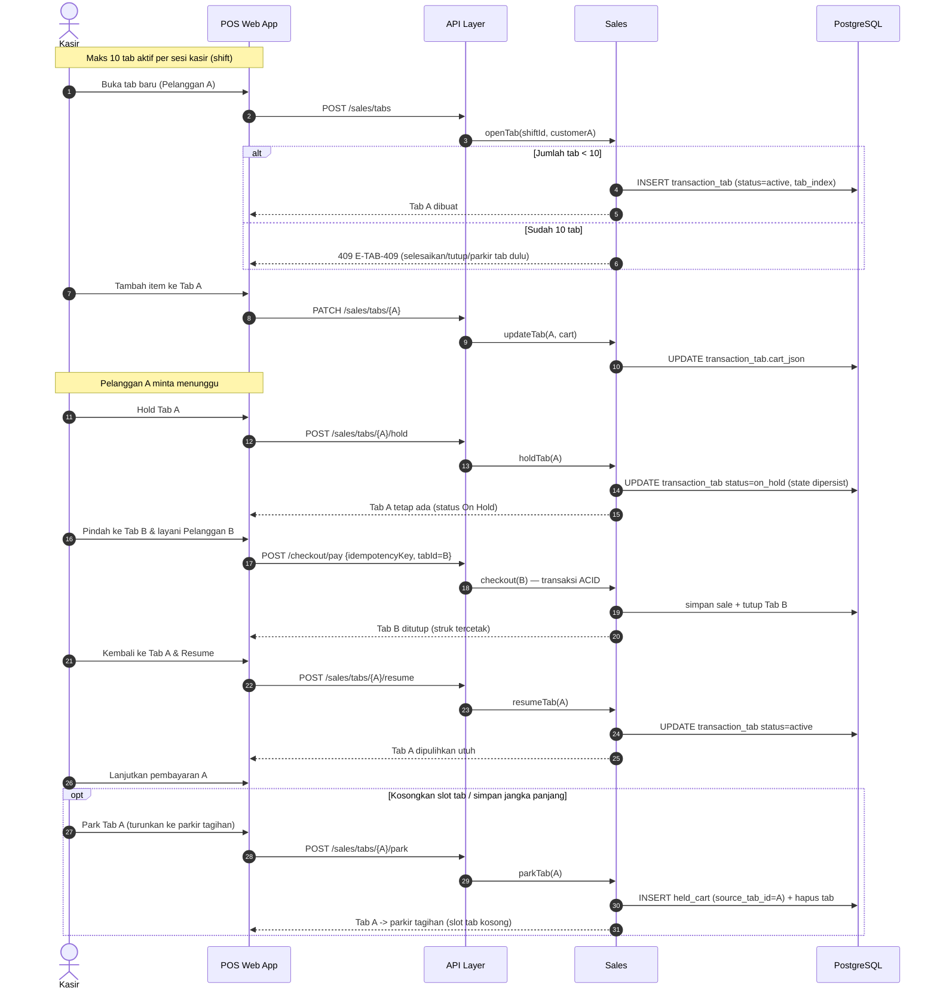
```mermaid
sequenceDiagram
    autonumber
    actor Kasir
    participant POS as POS Web App
    participant API as API Layer
    participant SAL as Sales
    participant DB as PostgreSQL
 
    Note over Kasir,POS: Maks 10 tab aktif per sesi kasir (shift)
 
    Kasir->>POS: Buka tab baru (Pelanggan A)
    POS->>API: POST /sales/tabs
    API->>SAL: openTab(shiftId, customerA)
    alt Jumlah tab < 10
        SAL->>DB: INSERT transaction_tab (status=active, tab_index)
        SAL-->>POS: Tab A dibuat
    else Sudah 10 tab
        SAL-->>POS: 409 E-TAB-409 (selesaikan/tutup/parkir tab dulu)
    end
 
    Kasir->>POS: Tambah item ke Tab A
    POS->>API: PATCH /sales/tabs/{A}
    API->>SAL: updateTab(A, cart)
    SAL->>DB: UPDATE transaction_tab.cart_json
 
    Note over Kasir,POS: Pelanggan A minta menunggu
    Kasir->>POS: Hold Tab A
    POS->>API: POST /sales/tabs/{A}/hold
    API->>SAL: holdTab(A)
    SAL->>DB: UPDATE transaction_tab status=on_hold (state dipersist)
    SAL-->>POS: Tab A tetap ada (status On Hold)
 
    Kasir->>POS: Pindah ke Tab B & layani Pelanggan B
    POS->>API: POST /checkout/pay {idempotencyKey, tabId=B}
    API->>SAL: checkout(B) — transaksi ACID
    SAL->>DB: simpan sale + tutup Tab B
    SAL-->>POS: Tab B ditutup (struk tercetak)
 
    Kasir->>POS: Kembali ke Tab A & Resume
    POS->>API: POST /sales/tabs/{A}/resume
    API->>SAL: resumeTab(A)
    SAL->>DB: UPDATE transaction_tab status=active
    SAL-->>POS: Tab A dipulihkan utuh
    Kasir->>POS: Lanjutkan pembayaran A
 
    opt Kosongkan slot tab / simpan jangka panjang
        Kasir->>POS: Park Tab A (turunkan ke parkir tagihan)
        POS->>API: POST /sales/tabs/{A}/park
        API->>SAL: parkTab(A)
        SAL->>DB: INSERT held_cart (source_tab_id=A) + hapus tab
        SAL-->>POS: Tab A -> parkir tagihan (slot tab kosong)
    end
```
 
---
 
## 6. Cash Control: Buka & Tutup Shift (Deteksi Fraud)
 
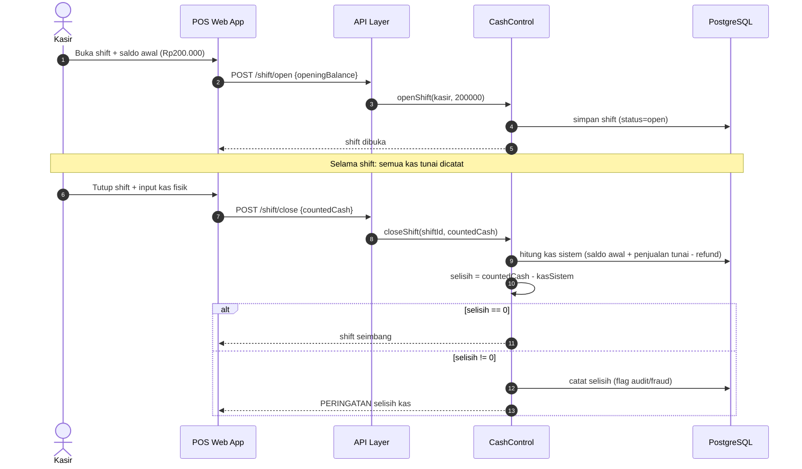
```mermaid
sequenceDiagram
    autonumber
    actor Kasir
    participant POS as POS Web App
    participant API as API Layer
    participant CSH as CashControl
    participant DB as PostgreSQL
 
    Kasir->>POS: Buka shift + saldo awal (Rp200.000)
    POS->>API: POST /shift/open {openingBalance}
    API->>CSH: openShift(kasir, 200000)
    CSH->>DB: simpan shift (status=open)
    CSH-->>POS: shift dibuka
 
    Note over Kasir,DB: Selama shift: semua kas tunai dicatat
 
    Kasir->>POS: Tutup shift + input kas fisik
    POS->>API: POST /shift/close {countedCash}
    API->>CSH: closeShift(shiftId, countedCash)
    CSH->>DB: hitung kas sistem (saldo awal + penjualan tunai - refund)
    CSH->>CSH: selisih = countedCash - kasSistem
    alt selisih == 0
        CSH-->>POS: shift seimbang
    else selisih != 0
        CSH->>DB: catat selisih (flag audit/fraud)
        CSH-->>POS: PERINGATAN selisih kas
    end
```
 
---
 
## 7. Penjualan Kredit / Partial + Payment Reminder
 
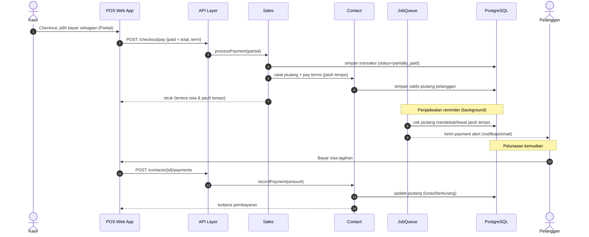
```mermaid
sequenceDiagram
    autonumber
    actor Kasir
    participant POS as POS Web App
    participant API as API Layer
    participant SAL as Sales
    participant CON as Contact
    participant JOB as JobQueue
    participant DB as PostgreSQL
    actor Pelanggan
 
    Kasir->>POS: Checkout, pilih bayar sebagian (Partial)
    POS->>API: POST /checkout/pay {paid < total, term}
    API->>SAL: processPayment(partial)
    SAL->>DB: simpan transaksi (status=partially_paid)
    SAL->>CON: catat piutang + pay terms (jatuh tempo)
    CON->>DB: simpan saldo piutang pelanggan
    SAL-->>POS: struk (tertera sisa & jatuh tempo)
 
    Note over JOB,DB: Penjadwalan reminder (background)
    JOB->>DB: cek piutang mendekati/lewat jatuh tempo
    JOB-->>Pelanggan: kirim payment alert (notifikasi/email)
 
    Note over Pelanggan,DB: Pelunasan kemudian
    Pelanggan->>POS: Bayar sisa tagihan
    POS->>API: POST /contacts/{id}/payments
    API->>CON: recordPayment(amount)
    CON->>DB: update piutang (lunas/berkurang)
    CON-->>POS: kuitansi pembayaran
```
 
---
 
## 8. Sales Return (Retur Penjualan)
 
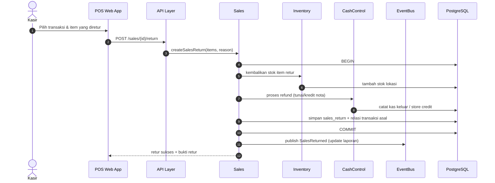
```mermaid
sequenceDiagram
    autonumber
    actor Kasir
    participant POS as POS Web App
    participant API as API Layer
    participant SAL as Sales
    participant INV as Inventory
    participant CSH as CashControl
    participant BUS as EventBus
    participant DB as PostgreSQL
 
    Kasir->>POS: Pilih transaksi & item yang diretur
    POS->>API: POST /sales/{id}/return
    API->>SAL: createSalesReturn(items, reason)
    SAL->>DB: BEGIN
    SAL->>INV: kembalikan stok item retur
    INV->>DB: tambah stok lokasi
    SAL->>CSH: proses refund (tunai/kredit nota)
    CSH->>DB: catat kas keluar / store credit
    SAL->>DB: simpan sales_return + relasi transaksi asal
    SAL->>DB: COMMIT
    SAL->>BUS: publish SalesReturned (update laporan)
    SAL-->>POS: retur sukses + bukti retur
```
 
---
 
## 9. Penjualan dengan Commission Agent
 
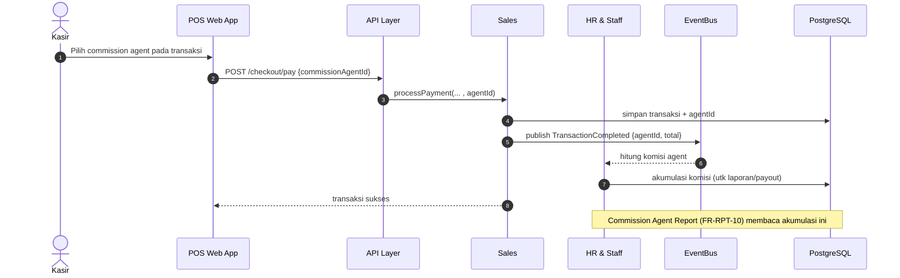
```mermaid
sequenceDiagram
    autonumber
    actor Kasir
    participant POS as POS Web App
    participant API as API Layer
    participant SAL as Sales
    participant HRM as HR & Staff
    participant BUS as EventBus
    participant DB as PostgreSQL
 
    Kasir->>POS: Pilih commission agent pada transaksi
    POS->>API: POST /checkout/pay {commissionAgentId}
    API->>SAL: processPayment(... , agentId)
    SAL->>DB: simpan transaksi + agentId
    SAL->>BUS: publish TransactionCompleted {agentId, total}
    BUS-->>HRM: hitung komisi agent
    HRM->>DB: akumulasi komisi (utk laporan/payout)
    SAL-->>POS: transaksi sukses
    Note over HRM,DB: Commission Agent Report (FR-RPT-10) membaca akumulasi ini
```
 
---
 
## 10. Cetak Struk ESC/POS + Cash Drawer
 
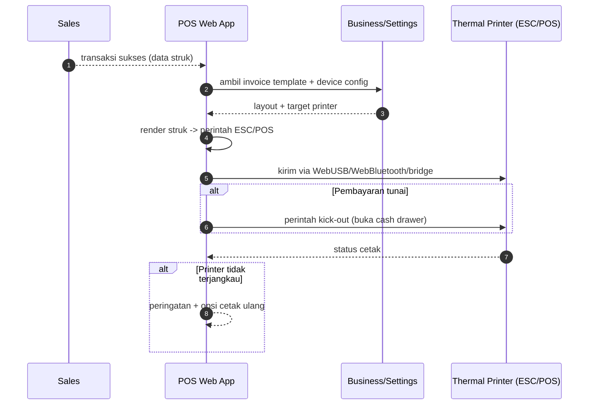
```mermaid
sequenceDiagram
    autonumber
    participant SAL as Sales
    participant POS as POS Web App
    participant CFG as Business/Settings
    participant PRN as Thermal Printer (ESC/POS)
 
    SAL-->>POS: transaksi sukses (data struk)
    POS->>CFG: ambil invoice template + device config
    CFG-->>POS: layout + target printer
    POS->>POS: render struk -> perintah ESC/POS
    POS->>PRN: kirim via WebUSB/WebBluetooth/bridge
    alt Pembayaran tunai
        POS->>PRN: perintah kick-out (buka cash drawer)
    end
    PRN-->>POS: status cetak
    alt Printer tidak terjangkau
        POS-->>POS: peringatan + opsi cetak ulang
    end
```
 
---
 
# C. Loyalty, Promo & Voucher
 
## 11. Loyalty Points: Perolehan & Penukaran
 
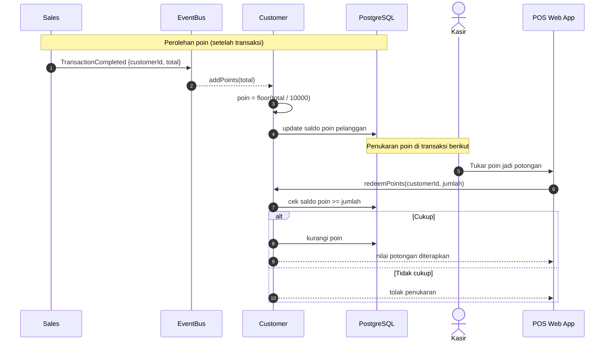
```mermaid
sequenceDiagram
    autonumber
    participant SAL as Sales
    participant BUS as EventBus
    participant CUS as Customer
    participant DB as PostgreSQL
    actor Kasir
    participant POS as POS Web App
 
    Note over SAL,DB: Perolehan poin (setelah transaksi)
    SAL->>BUS: TransactionCompleted {customerId, total}
    BUS-->>CUS: addPoints(total)
    CUS->>CUS: poin = floor(total / 10000)
    CUS->>DB: update saldo poin pelanggan
 
    Note over Kasir,DB: Penukaran poin di transaksi berikut
    Kasir->>POS: Tukar poin jadi potongan
    POS->>CUS: redeemPoints(customerId, jumlah)
    CUS->>DB: cek saldo poin >= jumlah
    alt Cukup
        CUS->>DB: kurangi poin
        CUS-->>POS: nilai potongan diterapkan
    else Tidak cukup
        CUS-->>POS: tolak penukaran
    end
```
 
---
 
## 12. Penerapan Diskon Bersyarat & Price Markdown
 
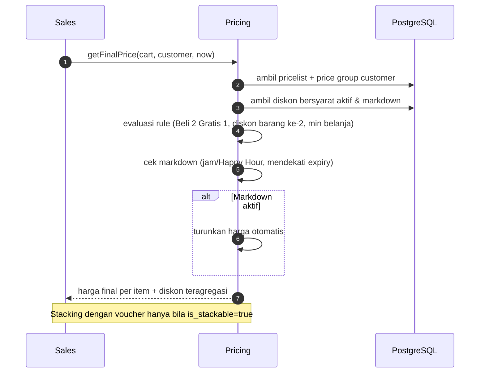
```mermaid
sequenceDiagram
    autonumber
    participant SAL as Sales
    participant PRC as Pricing
    participant DB as PostgreSQL
 
    SAL->>PRC: getFinalPrice(cart, customer, now)
    PRC->>DB: ambil pricelist + price group customer
    PRC->>DB: ambil diskon bersyarat aktif & markdown
    PRC->>PRC: evaluasi rule (Beli 2 Gratis 1, diskon barang ke-2, min belanja)
    PRC->>PRC: cek markdown (jam/Happy Hour, mendekati expiry)
    alt Markdown aktif
        PRC->>PRC: turunkan harga otomatis
    end
    PRC-->>SAL: harga final per item + diskon teragregasi
    Note over PRC,SAL: Stacking dengan voucher hanya bila is_stackable=true
```
 
---
 
## 13. Generate Voucher Batch (Admin)
 
```mermaid
sequenceDiagram
    autonumber
    actor Admin
    participant WEB as Admin Dashboard
    participant API as API Layer
    participant PRC as Pricing
    participant DB as PostgreSQL
 
    Admin->>WEB: Buat batch voucher (jenis, nilai, jumlah, masa berlaku, scope)
    WEB->>API: POST /vouchers {batchConfig, count}
    API->>PRC: generateBatch(config, count)
    loop sejumlah count
        PRC->>PRC: generate kode unik
        PRC->>DB: INSERT voucher (status=active, batch_id)
    end
    PRC-->>WEB: daftar kode + QR siap cetak
    Admin->>WEB: Cetak voucher fisik (kode/QR)
    Note over PRC,DB: code UNIQUE; siap divalidasi di kasir (lihat #4)
```
 
---
 
# D. Produk & Stok
 
## 14. Buat Produk Variable & Import CSV
 
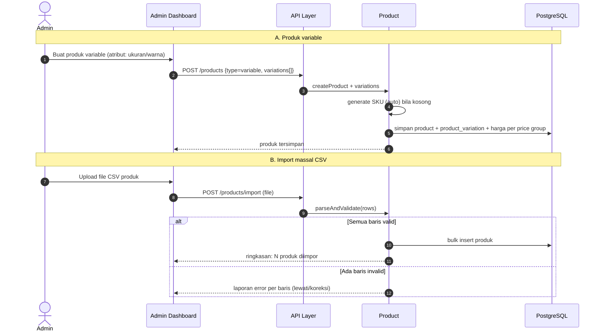
```mermaid
sequenceDiagram
    autonumber
    actor Admin
    participant WEB as Admin Dashboard
    participant API as API Layer
    participant PRD as Product
    participant DB as PostgreSQL
 
    Note over Admin,DB: A. Produk variable
    Admin->>WEB: Buat produk variable (atribut: ukuran/warna)
    WEB->>API: POST /products {type=variable, variations[]}
    API->>PRD: createProduct + variations
    PRD->>PRD: generate SKU (auto) bila kosong
    PRD->>DB: simpan product + product_variation + harga per price group
    PRD-->>WEB: produk tersimpan
 
    Note over Admin,DB: B. Import massal CSV
    Admin->>WEB: Upload file CSV produk
    WEB->>API: POST /products/import (file)
    API->>PRD: parseAndValidate(rows)
    alt Semua baris valid
        PRD->>DB: bulk insert produk
        PRD-->>WEB: ringkasan: N produk diimpor
    else Ada baris invalid
        PRD-->>WEB: laporan error per baris (lewati/koreksi)
    end
```
 
---
 
## 15. Cetak Barcode & Label
 
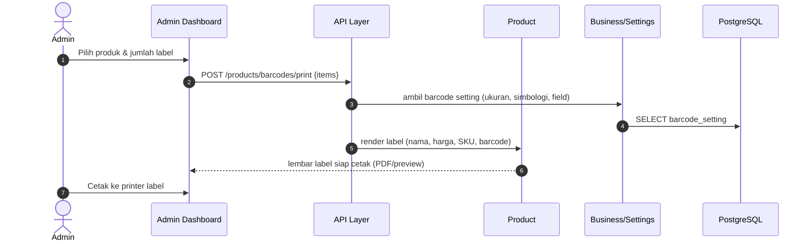
```mermaid
sequenceDiagram
    autonumber
    actor Admin
    participant WEB as Admin Dashboard
    participant API as API Layer
    participant PRD as Product
    participant CFG as Business/Settings
    participant DB as PostgreSQL
 
    Admin->>WEB: Pilih produk & jumlah label
    WEB->>API: POST /products/barcodes/print {items}
    API->>CFG: ambil barcode setting (ukuran, simbologi, field)
    CFG->>DB: SELECT barcode_setting
    API->>PRD: render label (nama, harga, SKU, barcode)
    PRD-->>WEB: lembar label siap cetak (PDF/preview)
    Admin->>WEB: Cetak ke printer label
```
 
---
 
## 16. Real-time Stock Checking Antar Cabang
 
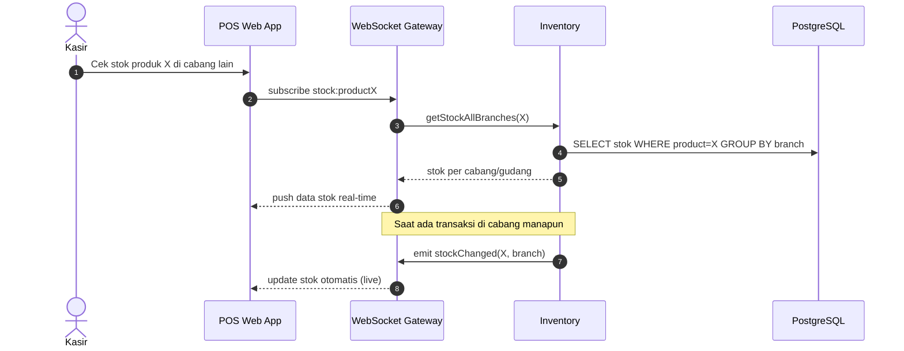
```mermaid
sequenceDiagram
    autonumber
    actor Kasir
    participant POS as POS Web App
    participant WS as WebSocket Gateway
    participant INV as Inventory
    participant DB as PostgreSQL
 
    Kasir->>POS: Cek stok produk X di cabang lain
    POS->>WS: subscribe stock:productX
    WS->>INV: getStockAllBranches(X)
    INV->>DB: SELECT stok WHERE product=X GROUP BY branch
    INV-->>WS: stok per cabang/gudang
    WS-->>POS: push data stok real-time
 
    Note over INV,WS: Saat ada transaksi di cabang manapun
    INV->>WS: emit stockChanged(X, branch)
    WS-->>POS: update stok otomatis (live)
```
 
---
 
## 17. Stock Adjustment (Penyesuaian Stok)
 
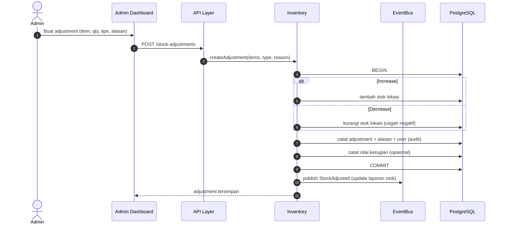
```mermaid
sequenceDiagram
    autonumber
    actor Admin
    participant WEB as Admin Dashboard
    participant API as API Layer
    participant INV as Inventory
    participant BUS as EventBus
    participant DB as PostgreSQL
 
    Admin->>WEB: Buat adjustment (item, qty, tipe, alasan)
    WEB->>API: POST /stock-adjustments
    API->>INV: createAdjustment(items, type, reason)
    INV->>DB: BEGIN
    alt Increase
        INV->>DB: tambah stok lokasi
    else Decrease
        INV->>DB: kurangi stok lokasi (cegah negatif)
    end
    INV->>DB: catat adjustment + alasan + user (audit)
    INV->>DB: catat nilai kerugian (opsional)
    INV->>DB: COMMIT
    INV->>BUS: publish StockAdjusted (update laporan stok)
    INV-->>WEB: adjustment tersimpan
```
 
---
 
## 18. Stock Transfer Antar Lokasi (In Transit -> Completed)
 
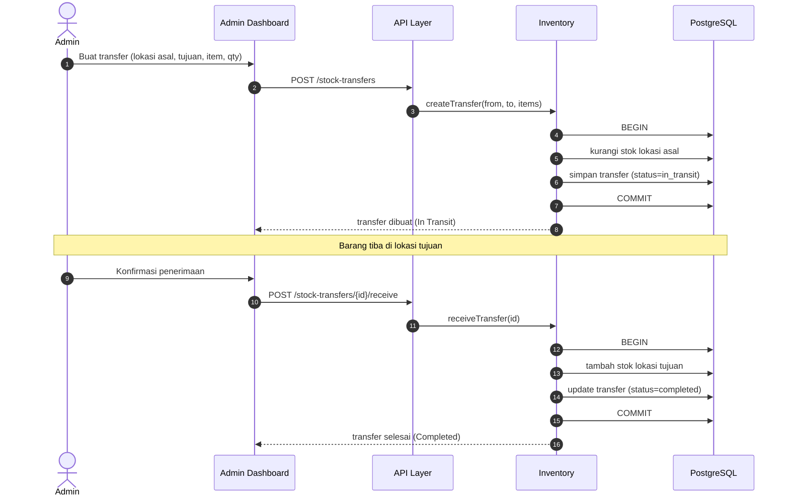
```mermaid
sequenceDiagram
    autonumber
    actor Admin
    participant WEB as Admin Dashboard
    participant API as API Layer
    participant INV as Inventory
    participant DB as PostgreSQL
 
    Admin->>WEB: Buat transfer (lokasi asal, tujuan, item, qty)
    WEB->>API: POST /stock-transfers
    API->>INV: createTransfer(from, to, items)
    INV->>DB: BEGIN
    INV->>DB: kurangi stok lokasi asal
    INV->>DB: simpan transfer (status=in_transit)
    INV->>DB: COMMIT
    INV-->>WEB: transfer dibuat (In Transit)
 
    Note over Admin,DB: Barang tiba di lokasi tujuan
    Admin->>WEB: Konfirmasi penerimaan
    WEB->>API: POST /stock-transfers/{id}/receive
    API->>INV: receiveTransfer(id)
    INV->>DB: BEGIN
    INV->>DB: tambah stok lokasi tujuan
    INV->>DB: update transfer (status=completed)
    INV->>DB: COMMIT
    INV-->>WEB: transfer selesai (Completed)
```
 
---
 
## 19. Alert Low Stock & Expiry (Background Job)
 
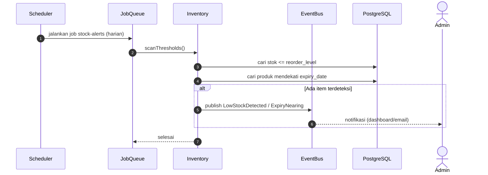
```mermaid
sequenceDiagram
    autonumber
    participant CRON as Scheduler
    participant JOB as JobQueue
    participant INV as Inventory
    participant BUS as EventBus
    participant DB as PostgreSQL
    actor Admin
 
    CRON->>JOB: jalankan job stock-alerts (harian)
    JOB->>INV: scanThresholds()
    INV->>DB: cari stok <= reorder_level
    INV->>DB: cari produk mendekati expiry_date
    alt Ada item terdeteksi
        INV->>BUS: publish LowStockDetected / ExpiryNearing
        BUS-->>Admin: notifikasi (dashboard/email)
    end
    INV-->>JOB: selesai
```
 
---
 
# E. Pembelian & Kontak
 
## 20. Pembelian (Purchase) & Penerimaan Stok
 
```mermaid
sequenceDiagram
    autonumber
    actor Admin
    participant WEB as Admin Dashboard
    participant API as API Layer
    participant PUR as Purchasing
    participant CON as Contact
    participant INV as Inventory
    participant BUS as EventBus
    participant DB as PostgreSQL
 
    Admin->>WEB: Buat purchase (pilih supplier, item, lot, expiry)
    WEB->>API: POST /purchases
    API->>CON: cek supplier & pay terms
    CON-->>API: data supplier
    API->>PUR: createPurchase(items, taxes, discount, shipping)
    PUR->>DB: BEGIN
    PUR->>DB: simpan purchase (status=received)
    PUR->>BUS: publish PurchaseReceived
    BUS-->>INV: tambah stok (lot & expiry) per lokasi
    INV->>DB: update stok + catat lot/expiry
    PUR->>DB: catat hutang (Credit/Partial) bila belum lunas
    PUR->>DB: COMMIT
    PUR-->>WEB: purchase tersimpan + dokumen terlampir
    Note over PUR,DB: Job terjadwal -> payment reminder bila jatuh tempo
```
 
---
 
## 21. Purchase Return (Retur ke Supplier)
 
```mermaid
sequenceDiagram
    autonumber
    actor Admin
    participant WEB as Admin Dashboard
    participant API as API Layer
    participant PUR as Purchasing
    participant INV as Inventory
    participant DB as PostgreSQL
 
    Admin->>WEB: Buat purchase return (pilih purchase & item)
    WEB->>API: POST /purchases/{id}/return
    API->>PUR: createReturn(items)
    PUR->>DB: BEGIN
    PUR->>INV: kurangi stok (barang keluar/retur)
    INV->>DB: update stok lokasi
    PUR->>DB: sesuaikan saldo hutang / catat kredit nota
    PUR->>DB: COMMIT
    PUR-->>WEB: retur tercatat + penyesuaian hutang
```
 
---
 
## 22. Pembayaran Supplier & Contact Ledger
 
```mermaid
sequenceDiagram
    autonumber
    actor Admin
    participant WEB as Admin Dashboard
    participant API as API Layer
    participant CON as Contact
    participant ACC as Accounting
    participant BUS as EventBus
    participant DB as PostgreSQL
 
    Admin->>WEB: Bayar hutang supplier (pilih purchase)
    WEB->>API: POST /contacts/{id}/payments {amount, accountId}
    API->>CON: recordPayment(supplierId, amount)
    CON->>DB: BEGIN
    CON->>DB: kurangi saldo hutang (contact_ledger)
    CON->>BUS: publish PaymentMade {accountId, amount}
    BUS-->>ACC: posting kas keluar (update saldo akun)
    ACC->>DB: jurnal + saldo akun
    CON->>DB: COMMIT
    CON-->>WEB: pembayaran tercatat + sisa hutang
```
 
---
 
# F. Booking
 
## 23. Reservasi Meja/Staf + Pemantauan Kalender
 
```mermaid
sequenceDiagram
    autonumber
    actor Pelanggan
    participant CH as Kanal (Web/Eksternal)
    participant API as API Layer
    participant BOK as Booking
    participant WS as WebSocket Gateway
    participant DB as PostgreSQL
    actor Kasir
    participant POS as POS Web App
 
    Pelanggan->>CH: Pilih meja/staf + slot waktu
    CH->>API: POST /bookings {resource, startTime, endTime}
    API->>BOK: createBooking(...)
    BOK->>DB: cek bentrok slot
    alt Slot tersedia
        BOK->>DB: simpan booking (status=confirmed)
        BOK->>WS: emit booking:queue (update)
        WS-->>POS: antrean booking ter-update (live)
        BOK-->>CH: booking terkonfirmasi
    else Bentrok
        BOK-->>CH: slot tidak tersedia
    end
 
    Kasir->>POS: Buka UI Kalender Booking
    POS->>API: GET /bookings/calendar
    API->>BOK: getCalendar(range)
    BOK-->>POS: daftar reservasi (tampilan kalender)
```
 
---
 
## 24. Pre-Order / Click & Collect dengan Stock Hold (dari Sistem Eksternal)
 
```mermaid
sequenceDiagram
    autonumber
    participant EXT as Aplikasi Eksternal
    participant API as API Layer
    participant BOK as Booking
    participant INV as Inventory
    participant BUS as EventBus
    participant DB as PostgreSQL
    actor Kasir
    participant POS as POS Web App
 
    EXT->>API: POST /preorder {items, pickupTime}
    API->>BOK: createPreOrder(payload)
    BOK->>INV: holdStock(items)
    INV->>DB: kurangi available, tambah held
    INV-->>BOK: stok ditahan
    BOK->>DB: simpan pre-order (status=reserved)
    BOK->>BUS: publish PreOrderCreated
    BOK-->>EXT: konfirmasi + kode pickup (QR)
 
    Note over Kasir,POS: Saat pelanggan datang ambil
    Kasir->>POS: Scan QR pickup
    POS->>API: POST /preorder/collect {code}
    API->>BOK: collect(code)
    BOK->>INV: convertHoldToSale(items)
    INV->>DB: kurangi held (stok keluar)
    BOK-->>POS: pesanan siap diproses checkout
```
 
---
 
## 25. Booking dengan Deposit (DP) & Pelunasan
 
```mermaid
sequenceDiagram
    autonumber
    actor Pelanggan
    participant POS as POS Web App
    participant API as API Layer
    participant BOK as Booking
    participant CSH as CashControl
    participant SAL as Sales
    participant DB as PostgreSQL
 
    Pelanggan->>POS: Buat reservasi + bayar DP
    POS->>API: POST /booking {slot, dpAmount}
    API->>BOK: createBooking(slot, dp)
    BOK->>CSH: catatDP(dpAmount)
    CSH->>DB: simpan kas masuk (DP)
    BOK->>DB: simpan booking (status=confirmed, dp=dpAmount)
    BOK-->>POS: booking terkonfirmasi
 
    Note over Pelanggan,DB: Saat hari-H / pelunasan
    Pelanggan->>POS: Checkout pesanan booking
    POS->>API: POST /checkout/from-booking {bookingId}
    API->>SAL: buildCart(bookingId)
    SAL->>BOK: getDeposit(bookingId)
    BOK-->>SAL: dpAmount
    SAL->>SAL: total tagihan - DP = sisa bayar
    SAL-->>POS: tampilkan sisa tagihan
    Pelanggan->>POS: Bayar sisa
    POS->>API: POST /checkout/pay
    API->>SAL: processPayment()
    SAL->>DB: simpan transaksi (DP + pelunasan)
    SAL-->>POS: lunas + struk
```
 
---
 
# G. Scan
 
## 26. Scan Barcode via Smartphone (Opsi A - Kamera In-App Browser)
 
```mermaid
sequenceDiagram
    autonumber
    actor Kasir
    participant CAM as Kamera HP
    participant WEB as POS Web App
    participant DET as BarcodeDetector / ZXing
    participant API as API Layer
    participant INV as Inventory
 
    Kasir->>WEB: Buka mode scan
    WEB->>CAM: getUserMedia (minta izin kamera)
    alt Izin diberikan
        CAM-->>WEB: stream video
        WEB->>DET: decode frame
        DET-->>WEB: kode barcode terdeteksi
        WEB->>WEB: beep + highlight (umpan balik)
        WEB->>API: GET /product/by-barcode/{code}
        API->>INV: lookup(code)
        INV-->>WEB: data produk
        WEB-->>Kasir: produk masuk keranjang
    else Izin ditolak / kamera tidak ada
        WEB-->>Kasir: fallback input manual kode
    end
```
 
---
 
# H. Keuangan & Laporan
 
## 27. Pencatatan Pengeluaran (Expense Management)
 
```mermaid
sequenceDiagram
    autonumber
    actor Admin
    participant WEB as Admin Dashboard
    participant API as API Layer
    participant HRM as HR & Staff
    participant CSH as CashControl
    participant BUS as EventBus
    participant DB as PostgreSQL
 
    Admin->>WEB: Input expense (kategori, jumlah, lokasi)
    WEB->>API: POST /expenses
    API->>HRM: createExpense(category, amount, location)
    HRM->>DB: BEGIN
    HRM->>DB: simpan expense
    HRM->>CSH: catat kas keluar (bila tunai)
    CSH->>DB: update mutasi kas/register
    HRM->>DB: COMMIT
    HRM->>BUS: publish ExpenseRecorded (update P&L)
    HRM-->>WEB: expense tercatat
```
 
---
 
## 28. Posting Pembayaran ke Payment Account & Cash Flow
 
```mermaid
sequenceDiagram
    autonumber
    participant SAL as Sales
    participant PUR as Purchasing
    participant HRM as HR (Expense)
    participant BUS as EventBus
    participant ACC as Accounting
    participant DB as PostgreSQL
    actor Admin
    participant WEB as Admin Dashboard
 
    Note over SAL,ACC: Setiap transaksi memicu posting ke akun
    SAL->>BUS: PaymentReceived {accountId, amount}
    PUR->>BUS: PaymentMade {accountId, amount}
    HRM->>BUS: ExpenseRecorded {accountId, amount}
    BUS-->>ACC: postEntry(account, debit/kredit)
    ACC->>DB: catat jurnal + update saldo akun
 
    Note over Admin,DB: Lihat laporan keuangan
    Admin->>WEB: Buka Balance Sheet / Trial Balance / Cash Flow
    WEB->>ACC: getReport(type, period)
    ACC->>DB: agregasi saldo & mutasi akun
    ACC-->>WEB: Balance Sheet / Trial Balance / Cash Flow / Payment Account Report
```
 
---
 
## 29. Generate Laporan (Background Job)
 
```mermaid
sequenceDiagram
    autonumber
    actor Admin
    participant WEB as Admin Dashboard
    participant API as API Layer
    participant RPT as Reporting
    participant JOB as JobQueue
    participant DB as PostgreSQL
 
    Admin->>WEB: Minta laporan (jenis, filter, periode)
    WEB->>API: GET /reports/{type}?filter
    alt Laporan ringan
        API->>RPT: query langsung
        RPT->>DB: agregasi data
        RPT-->>WEB: hasil + chart
    else Laporan berat
        API->>JOB: enqueue report-generation
        API-->>WEB: 202 (diproses), tampilkan progres
        JOB->>RPT: build report
        RPT->>DB: agregasi (read replica)
        RPT-->>JOB: file/cache siap
        JOB-->>WEB: notifikasi selesai + unduhan
    end
```
 
---
 
# I. Administrasi Pengguna
 
## 30. Manajemen User, Role & Permission (User Matrix)
 
```mermaid
sequenceDiagram
    autonumber
    actor Admin
    participant WEB as Admin Dashboard
    participant API as API Layer
    participant HRM as HR & Staff
    participant DB as PostgreSQL
 
    Admin->>WEB: Buka User Matrix (user x permission)
    WEB->>API: GET /users/{id}/matrix
    API->>HRM: getMatrix(userId)
    HRM->>DB: ambil roles, permissions, lokasi user
    HRM-->>WEB: matriks izin tercentang
 
    Admin->>WEB: Ubah role/permission + assign lokasi
    WEB->>API: PATCH /users/{id}/matrix {roles, permissions, locations}
    API->>HRM: updateMatrix(...)
    HRM->>DB: BEGIN
    HRM->>DB: update user_role, role_permission, user_location
    HRM->>DB: COMMIT
    HRM-->>WEB: izin diperbarui
    Note over HRM,WEB: Predefined roles (Admin & Cashier) tidak dapat dihapus
```
 