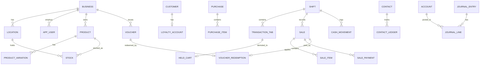

# Database Schema
# Sistem POS Modular Berbasis Monolith

> **Versi:** 1.0 (Online Web App + Tab Transaksi)
> **DBMS:** PostgreSQL 14+
> **Arsitektur:** Modular Monolith — satu database, skema logis per modul domain.
> **Dokumen terkait:** `PRD.md`, `SRS.md`, `Backend.md` (Bagian 9), `Frontend.md`, `Sequence_Diagram.md`

> **Catatan:** Sistem ini adalah **web app online** (bukan PWA/offline-first). Tidak ada tabel/penyimpanan sinkronisasi offline. Konsistensi keuangan & stok dijaga dengan **transaksi ACID**. Mendukung **tab transaksi multi-pelanggan** (maks 10 per sesi kasir; transaksi yang di-hold tetap menempati tab-nya).

---

## Daftar Isi
1. Konvensi Umum
2. Tipe Enum
3. Diagram Relasi (ERD Ringkas)
4. Modul: Business & Settings
5. Modul: Users / HRM
6. Modul: Product / Catalog
7. Modul: Stock
8. Modul: Pricing & Voucher
9. Modul: Customer / CRM
10. Modul: Sales (termasuk Tab Transaksi)
11. Modul: Purchase
12. Modul: Contact
13. Modul: Booking
14. Modul: Accounting
15. Modul: Cash Register
16. Ringkasan Constraint & Index Penting
17. Aturan Integritas & Transaksi ACID

---

## 1. Konvensi Umum

- **Primary key:** `id UUID DEFAULT gen_random_uuid()` (ekstensi `pgcrypto`). Alternatif: `BIGINT GENERATED ALWAYS AS IDENTITY`.
- **Multi-tenancy:** sebagian besar tabel memiliki `business_id` (dan `location_id` bila relevan) — row-level tenancy. Selalu di-index.
- **Audit kolom:** `created_at TIMESTAMPTZ NOT NULL DEFAULT now()`, `updated_at TIMESTAMPTZ`, `created_by UUID` (FK ke `app_user`). Untuk aksi sensitif disertai alasan.
- **Soft delete (opsional):** `deleted_at TIMESTAMPTZ NULL` pada entitas master (produk, kontak) bila diperlukan; transaksi keuangan tidak di-soft-delete (gunakan void/return).
- **Uang:** `NUMERIC(14,2)` (hindari float). Kuantitas: `NUMERIC(14,3)` untuk unit pecahan, atau `INTEGER` untuk item utuh.
- **Waktu:** `TIMESTAMPTZ` (UTC di DB; ditampilkan sesuai timezone bisnis).
- **Penamaan:** tabel `snake_case` tunggal, kolom `snake_case`. Tabel relasi N-N memakai gabungan nama.
- **Catatan:** `app_user` dipakai sebagai nama tabel pengguna (menghindari kata kunci `user` di PostgreSQL).

```sql
CREATE EXTENSION IF NOT EXISTS pgcrypto;     -- gen_random_uuid()
CREATE EXTENSION IF NOT EXISTS pg_trgm;      -- pencarian teks (opsional, untuk search produk/kontak)
```

---

## 2. Tipe Enum

```sql
CREATE TYPE location_type      AS ENUM ('store', 'warehouse');
CREATE TYPE device_type        AS ENUM ('printer', 'scanner', 'cash_drawer');
CREATE TYPE product_type       AS ENUM ('single', 'variable');
CREATE TYPE stock_adj_type     AS ENUM ('increase', 'decrease');
CREATE TYPE transfer_status    AS ENUM ('in_transit', 'completed', 'cancelled');
CREATE TYPE voucher_type       AS ENUM ('fixed', 'percent');
CREATE TYPE voucher_status     AS ENUM ('active', 'redeemed', 'expired', 'void');
CREATE TYPE loyalty_txn_type   AS ENUM ('earn', 'redeem');
CREATE TYPE sale_status        AS ENUM ('paid', 'partial', 'credit', 'held');
CREATE TYPE payment_method     AS ENUM ('cash', 'qris', 'card', 'cheque', 'transfer', 'voucher', 'points');
CREATE TYPE purchase_status    AS ENUM ('paid', 'partial', 'credit');
CREATE TYPE contact_type       AS ENUM ('supplier', 'customer', 'both');
CREATE TYPE booking_type       AS ENUM ('table', 'staff', 'slot');
CREATE TYPE booking_status     AS ENUM ('confirmed', 'collected', 'cancelled');
CREATE TYPE preorder_source    AS ENUM ('external', 'pos');
CREATE TYPE preorder_status    AS ENUM ('reserved', 'collected', 'cancelled');
CREATE TYPE account_type       AS ENUM ('cash', 'bank', 'ewallet', 'other');
CREATE TYPE shift_status       AS ENUM ('open', 'closed');
CREATE TYPE cash_movement_type AS ENUM ('in', 'out', 'sale', 'refund', 'expense');
CREATE TYPE tab_status         AS ENUM ('active', 'on_hold');   -- tab transaksi
```

---

## 3. Diagram Relasi (ERD Ringkas)



---

## 4. Modul: Business & Settings

```sql
CREATE TABLE business (
    id                    UUID PRIMARY KEY DEFAULT gen_random_uuid(),
    name                  TEXT NOT NULL,
    currency              CHAR(3) NOT NULL DEFAULT 'IDR',
    timezone              TEXT NOT NULL DEFAULT 'Asia/Jakarta',
    financial_year_start  DATE,
    default_profit_margin NUMERIC(5,2),
    tax_number            TEXT,
    created_at            TIMESTAMPTZ NOT NULL DEFAULT now(),
    updated_at            TIMESTAMPTZ
);

CREATE TABLE location (
    id          UUID PRIMARY KEY DEFAULT gen_random_uuid(),
    business_id UUID NOT NULL REFERENCES business(id) ON DELETE CASCADE,
    name        TEXT NOT NULL,
    type        location_type NOT NULL DEFAULT 'store',
    address     TEXT,
    created_at  TIMESTAMPTZ NOT NULL DEFAULT now()
);
CREATE INDEX idx_location_business ON location(business_id);

CREATE TABLE invoice_template (
    id          UUID PRIMARY KEY DEFAULT gen_random_uuid(),
    business_id UUID NOT NULL REFERENCES business(id) ON DELETE CASCADE,
    name        TEXT NOT NULL,
    layout_json JSONB NOT NULL,
    is_default  BOOLEAN NOT NULL DEFAULT false
);

CREATE TABLE barcode_setting (
    id          UUID PRIMARY KEY DEFAULT gen_random_uuid(),
    business_id UUID NOT NULL REFERENCES business(id) ON DELETE CASCADE,
    label_size  TEXT,
    columns     INTEGER,
    symbology   TEXT,             -- EAN-13, Code128, dst.
    fields_json JSONB
);

CREATE TABLE device (
    id          UUID PRIMARY KEY DEFAULT gen_random_uuid(),
    business_id UUID NOT NULL REFERENCES business(id) ON DELETE CASCADE,
    location_id UUID REFERENCES location(id) ON DELETE SET NULL,
    type        device_type NOT NULL,
    config_json JSONB
);
```

---

## 5. Modul: Users / HRM

```sql
CREATE TABLE app_user (
    id            UUID PRIMARY KEY DEFAULT gen_random_uuid(),
    business_id   UUID NOT NULL REFERENCES business(id) ON DELETE CASCADE,
    name          TEXT NOT NULL,
    email         TEXT NOT NULL,
    password_hash TEXT NOT NULL,
    status        TEXT NOT NULL DEFAULT 'active',
    created_at    TIMESTAMPTZ NOT NULL DEFAULT now(),
    UNIQUE (business_id, email)
);

CREATE TABLE role (
    id            UUID PRIMARY KEY DEFAULT gen_random_uuid(),
    business_id   UUID NOT NULL REFERENCES business(id) ON DELETE CASCADE,
    name          TEXT NOT NULL,
    is_predefined BOOLEAN NOT NULL DEFAULT false,
    UNIQUE (business_id, name)
);

CREATE TABLE permission (
    id          UUID PRIMARY KEY DEFAULT gen_random_uuid(),
    code        TEXT NOT NULL UNIQUE,     -- mis. 'sale.create'
    description TEXT
);

CREATE TABLE role_permission (
    role_id       UUID NOT NULL REFERENCES role(id) ON DELETE CASCADE,
    permission_id UUID NOT NULL REFERENCES permission(id) ON DELETE CASCADE,
    PRIMARY KEY (role_id, permission_id)
);

CREATE TABLE user_role (
    user_id UUID NOT NULL REFERENCES app_user(id) ON DELETE CASCADE,
    role_id UUID NOT NULL REFERENCES role(id) ON DELETE CASCADE,
    PRIMARY KEY (user_id, role_id)
);

CREATE TABLE user_location (
    user_id     UUID NOT NULL REFERENCES app_user(id) ON DELETE CASCADE,
    location_id UUID NOT NULL REFERENCES location(id) ON DELETE CASCADE,
    PRIMARY KEY (user_id, location_id)
);

CREATE TABLE commission_agent (
    id          UUID PRIMARY KEY DEFAULT gen_random_uuid(),
    business_id UUID NOT NULL REFERENCES business(id) ON DELETE CASCADE,
    user_id     UUID REFERENCES app_user(id) ON DELETE SET NULL,
    rate        NUMERIC(5,2) NOT NULL DEFAULT 0   -- persen komisi
);

CREATE TABLE payroll (
    id          UUID PRIMARY KEY DEFAULT gen_random_uuid(),
    business_id UUID NOT NULL REFERENCES business(id) ON DELETE CASCADE,
    user_id     UUID NOT NULL REFERENCES app_user(id) ON DELETE CASCADE,
    period      TEXT NOT NULL,
    amount      NUMERIC(14,2) NOT NULL,
    created_at  TIMESTAMPTZ NOT NULL DEFAULT now()
);

CREATE TABLE expense (
    id          UUID PRIMARY KEY DEFAULT gen_random_uuid(),
    business_id UUID NOT NULL REFERENCES business(id) ON DELETE CASCADE,
    location_id UUID REFERENCES location(id) ON DELETE SET NULL,
    category    TEXT,
    amount      NUMERIC(14,2) NOT NULL,
    account_id  UUID,             -- FK ke account(id) (Modul Accounting)
    date        DATE NOT NULL DEFAULT CURRENT_DATE,
    note        TEXT,
    created_at  TIMESTAMPTZ NOT NULL DEFAULT now()
);
```

---

## 6. Modul: Product / Catalog

```sql
CREATE TABLE brand (
    id UUID PRIMARY KEY DEFAULT gen_random_uuid(),
    business_id UUID NOT NULL REFERENCES business(id) ON DELETE CASCADE,
    name TEXT NOT NULL
);

CREATE TABLE category (
    id UUID PRIMARY KEY DEFAULT gen_random_uuid(),
    business_id UUID NOT NULL REFERENCES business(id) ON DELETE CASCADE,
    name TEXT NOT NULL,
    parent_id UUID REFERENCES category(id) ON DELETE SET NULL
);

CREATE TABLE unit (
    id UUID PRIMARY KEY DEFAULT gen_random_uuid(),
    business_id UUID NOT NULL REFERENCES business(id) ON DELETE CASCADE,
    name TEXT NOT NULL,
    short_name TEXT
);

CREATE TABLE tax (
    id UUID PRIMARY KEY DEFAULT gen_random_uuid(),
    business_id UUID NOT NULL REFERENCES business(id) ON DELETE CASCADE,
    name TEXT NOT NULL,
    rate NUMERIC(5,2) NOT NULL
);

CREATE TABLE tax_group (
    id UUID PRIMARY KEY DEFAULT gen_random_uuid(),
    business_id UUID NOT NULL REFERENCES business(id) ON DELETE CASCADE,
    name TEXT NOT NULL
);
CREATE TABLE tax_group_item (
    tax_group_id UUID NOT NULL REFERENCES tax_group(id) ON DELETE CASCADE,
    tax_id       UUID NOT NULL REFERENCES tax(id) ON DELETE CASCADE,
    PRIMARY KEY (tax_group_id, tax_id)
);

CREATE TABLE product (
    id           UUID PRIMARY KEY DEFAULT gen_random_uuid(),
    business_id  UUID NOT NULL REFERENCES business(id) ON DELETE CASCADE,
    name         TEXT NOT NULL,
    type         product_type NOT NULL DEFAULT 'single',
    brand_id     UUID REFERENCES brand(id) ON DELETE SET NULL,
    category_id  UUID REFERENCES category(id) ON DELETE SET NULL,
    unit_id      UUID REFERENCES unit(id) ON DELETE SET NULL,
    tax_id       UUID REFERENCES tax(id) ON DELETE SET NULL,
    tax_group_id UUID REFERENCES tax_group(id) ON DELETE SET NULL,
    manage_stock BOOLEAN NOT NULL DEFAULT true,
    has_expiry   BOOLEAN NOT NULL DEFAULT false,
    sku          TEXT,
    barcode      TEXT,
    created_at   TIMESTAMPTZ NOT NULL DEFAULT now(),
    deleted_at   TIMESTAMPTZ,
    UNIQUE (business_id, sku)
);
CREATE INDEX idx_product_business ON product(business_id);
CREATE INDEX idx_product_barcode  ON product(business_id, barcode);

CREATE TABLE product_variation (
    id          UUID PRIMARY KEY DEFAULT gen_random_uuid(),
    product_id  UUID NOT NULL REFERENCES product(id) ON DELETE CASCADE,
    name        TEXT NOT NULL,
    sku         TEXT,
    barcode     TEXT,
    attributes_json JSONB
);
CREATE INDEX idx_variation_product ON product_variation(product_id);

CREATE TABLE selling_price_group (
    id UUID PRIMARY KEY DEFAULT gen_random_uuid(),
    business_id UUID NOT NULL REFERENCES business(id) ON DELETE CASCADE,
    name TEXT NOT NULL
);

CREATE TABLE product_price (
    id             UUID PRIMARY KEY DEFAULT gen_random_uuid(),
    product_id     UUID REFERENCES product(id) ON DELETE CASCADE,
    variation_id   UUID REFERENCES product_variation(id) ON DELETE CASCADE,
    price_group_id UUID REFERENCES selling_price_group(id) ON DELETE CASCADE,
    price          NUMERIC(14,2) NOT NULL,
    CHECK (product_id IS NOT NULL OR variation_id IS NOT NULL)
);
```

---

## 7. Modul: Stock

```sql
CREATE TABLE stock (
    id           UUID PRIMARY KEY DEFAULT gen_random_uuid(),
    business_id  UUID NOT NULL REFERENCES business(id) ON DELETE CASCADE,
    location_id  UUID NOT NULL REFERENCES location(id) ON DELETE CASCADE,
    product_id   UUID REFERENCES product(id) ON DELETE CASCADE,
    variation_id UUID REFERENCES product_variation(id) ON DELETE CASCADE,
    qty          NUMERIC(14,3) NOT NULL DEFAULT 0,
    qty_held     NUMERIC(14,3) NOT NULL DEFAULT 0,   -- untuk pre-order/booking
    CHECK (qty >= 0 AND qty_held >= 0),
    UNIQUE (location_id, product_id, variation_id)
);
CREATE INDEX idx_stock_lookup ON stock(business_id, location_id, product_id);

CREATE TABLE stock_serial (
    id          UUID PRIMARY KEY DEFAULT gen_random_uuid(),
    stock_id    UUID NOT NULL REFERENCES stock(id) ON DELETE CASCADE,
    imei_serial TEXT,
    lot_number  TEXT,
    expiry_date DATE
);

CREATE TABLE stock_adjustment (
    id              UUID PRIMARY KEY DEFAULT gen_random_uuid(),
    business_id     UUID NOT NULL REFERENCES business(id) ON DELETE CASCADE,
    location_id     UUID NOT NULL REFERENCES location(id) ON DELETE CASCADE,
    type            stock_adj_type NOT NULL,
    reason          TEXT NOT NULL,
    recovery_amount NUMERIC(14,2),
    created_by      UUID REFERENCES app_user(id),
    created_at      TIMESTAMPTZ NOT NULL DEFAULT now()
);
CREATE TABLE stock_adjustment_item (
    adjustment_id UUID NOT NULL REFERENCES stock_adjustment(id) ON DELETE CASCADE,
    product_id    UUID REFERENCES product(id),
    variation_id  UUID REFERENCES product_variation(id),
    qty           NUMERIC(14,3) NOT NULL
);

CREATE TABLE stock_transfer (
    id               UUID PRIMARY KEY DEFAULT gen_random_uuid(),
    business_id      UUID NOT NULL REFERENCES business(id) ON DELETE CASCADE,
    from_location_id UUID NOT NULL REFERENCES location(id),
    to_location_id   UUID NOT NULL REFERENCES location(id),
    status           transfer_status NOT NULL DEFAULT 'in_transit',
    shipping_charge  NUMERIC(14,2) DEFAULT 0,
    created_at       TIMESTAMPTZ NOT NULL DEFAULT now(),
    received_at      TIMESTAMPTZ,
    CHECK (from_location_id <> to_location_id)
);
CREATE TABLE stock_transfer_item (
    transfer_id  UUID NOT NULL REFERENCES stock_transfer(id) ON DELETE CASCADE,
    product_id   UUID REFERENCES product(id),
    variation_id UUID REFERENCES product_variation(id),
    qty          NUMERIC(14,3) NOT NULL
);
```

---

## 8. Modul: Pricing & Voucher

```sql
CREATE TABLE discount (
    id          UUID PRIMARY KEY DEFAULT gen_random_uuid(),
    business_id UUID NOT NULL REFERENCES business(id) ON DELETE CASCADE,
    type        TEXT NOT NULL,           -- buyXgetY | percent_2nd | min_purchase | ...
    config_json JSONB NOT NULL,
    start_date  DATE,
    end_date    DATE,
    active      BOOLEAN NOT NULL DEFAULT true
);

CREATE TABLE markdown (
    id          UUID PRIMARY KEY DEFAULT gen_random_uuid(),
    business_id UUID NOT NULL REFERENCES business(id) ON DELETE CASCADE,
    product_id  UUID REFERENCES product(id) ON DELETE CASCADE,
    rule        TEXT NOT NULL,           -- hour | expiry
    config_json JSONB NOT NULL
);

CREATE TABLE voucher (
    id            UUID PRIMARY KEY DEFAULT gen_random_uuid(),
    business_id   UUID NOT NULL REFERENCES business(id) ON DELETE CASCADE,
    code          TEXT NOT NULL,
    type          voucher_type NOT NULL,
    value         NUMERIC(14,2) NOT NULL,
    max_discount  NUMERIC(14,2),
    min_purchase  NUMERIC(14,2),
    branch_scope  JSONB,                 -- daftar location_id berlaku (null = semua)
    product_scope JSONB,
    start_date    DATE,
    expiry_date   DATE,
    status        voucher_status NOT NULL DEFAULT 'active',
    is_stackable  BOOLEAN NOT NULL DEFAULT false,
    batch_id      UUID,
    created_at    TIMESTAMPTZ NOT NULL DEFAULT now(),
    UNIQUE (business_id, code)           -- kode voucher unik per bisnis
);
CREATE INDEX idx_voucher_code ON voucher(business_id, code);

CREATE TABLE voucher_redemption (
    id          UUID PRIMARY KEY DEFAULT gen_random_uuid(),
    voucher_id  UUID NOT NULL UNIQUE REFERENCES voucher(id),  -- UNIQUE = single-use
    sale_id     UUID,                                          -- FK ke sale(id)
    branch_id   UUID REFERENCES location(id),
    cashier_id  UUID REFERENCES app_user(id),
    amount_used NUMERIC(14,2) NOT NULL,
    redeemed_at TIMESTAMPTZ NOT NULL DEFAULT now()
);
```

> **Kunci anti-fraud:** `voucher_redemption.voucher_id` **UNIQUE** menjamin voucher single-use di level database, walaupun ada request bersamaan (race condition). Redemption dibungkus transaksi + `SELECT ... FOR UPDATE`.

---

## 9. Modul: Customer / CRM

```sql
CREATE TABLE customer (
    id             UUID PRIMARY KEY DEFAULT gen_random_uuid(),
    business_id    UUID NOT NULL REFERENCES business(id) ON DELETE CASCADE,
    name           TEXT NOT NULL,
    phone          TEXT,
    email          TEXT,
    category       TEXT,                 -- retail | grosir | ...
    price_group_id UUID REFERENCES selling_price_group(id) ON DELETE SET NULL,
    created_at     TIMESTAMPTZ NOT NULL DEFAULT now()
);
CREATE INDEX idx_customer_business ON customer(business_id);

CREATE TABLE loyalty_account (
    id             UUID PRIMARY KEY DEFAULT gen_random_uuid(),
    customer_id    UUID NOT NULL UNIQUE REFERENCES customer(id) ON DELETE CASCADE,
    points_balance INTEGER NOT NULL DEFAULT 0
);

CREATE TABLE loyalty_transaction (
    id          UUID PRIMARY KEY DEFAULT gen_random_uuid(),
    customer_id UUID NOT NULL REFERENCES customer(id) ON DELETE CASCADE,
    type        loyalty_txn_type NOT NULL,
    points      INTEGER NOT NULL,
    sale_id     UUID,
    created_at  TIMESTAMPTZ NOT NULL DEFAULT now()
);

CREATE TABLE membership (
    id          UUID PRIMARY KEY DEFAULT gen_random_uuid(),
    business_id UUID NOT NULL REFERENCES business(id) ON DELETE CASCADE,
    name        TEXT NOT NULL,
    rules_json  JSONB
);
```

---

## 10. Modul: Sales (termasuk Tab Transaksi)

```sql
CREATE TABLE sale (
    id                  UUID PRIMARY KEY DEFAULT gen_random_uuid(),
    business_id         UUID NOT NULL REFERENCES business(id) ON DELETE CASCADE,
    location_id         UUID NOT NULL REFERENCES location(id),
    customer_id         UUID REFERENCES customer(id) ON DELETE SET NULL,
    cashier_id          UUID NOT NULL REFERENCES app_user(id),
    commission_agent_id UUID REFERENCES commission_agent(id) ON DELETE SET NULL,
    shift_id            UUID,            -- FK ke shift(id)
    subtotal            NUMERIC(14,2) NOT NULL DEFAULT 0,
    tax_total           NUMERIC(14,2) NOT NULL DEFAULT 0,
    discount_total      NUMERIC(14,2) NOT NULL DEFAULT 0,
    shipping            NUMERIC(14,2) NOT NULL DEFAULT 0,
    grand_total         NUMERIC(14,2) NOT NULL DEFAULT 0,
    paid_total          NUMERIC(14,2) NOT NULL DEFAULT 0,
    status              sale_status NOT NULL,
    idempotency_key     TEXT NOT NULL,
    created_at          TIMESTAMPTZ NOT NULL DEFAULT now(),
    UNIQUE (business_id, idempotency_key)    -- anti-dobel saat retry jaringan
);
CREATE INDEX idx_sale_business_date ON sale(business_id, created_at);

CREATE TABLE sale_item (
    id           UUID PRIMARY KEY DEFAULT gen_random_uuid(),
    sale_id      UUID NOT NULL REFERENCES sale(id) ON DELETE CASCADE,
    product_id   UUID REFERENCES product(id),
    variation_id UUID REFERENCES product_variation(id),
    qty          NUMERIC(14,3) NOT NULL,
    unit_price   NUMERIC(14,2) NOT NULL,
    discount     NUMERIC(14,2) NOT NULL DEFAULT 0,
    tax          NUMERIC(14,2) NOT NULL DEFAULT 0,
    line_total   NUMERIC(14,2) NOT NULL,
    imei_serial  TEXT,
    lot_number   TEXT
);
CREATE INDEX idx_sale_item_sale ON sale_item(sale_id);

CREATE TABLE sale_payment (
    id         UUID PRIMARY KEY DEFAULT gen_random_uuid(),
    sale_id    UUID NOT NULL REFERENCES sale(id) ON DELETE CASCADE,
    method     payment_method NOT NULL,
    amount     NUMERIC(14,2) NOT NULL,
    account_id UUID,            -- FK ke account(id)
    ref        TEXT             -- no. voucher/kartu/transfer
);

CREATE TABLE sales_return (
    id            UUID PRIMARY KEY DEFAULT gen_random_uuid(),
    sale_id       UUID NOT NULL REFERENCES sale(id),
    business_id   UUID NOT NULL REFERENCES business(id) ON DELETE CASCADE,
    reason        TEXT,
    refund_method payment_method,
    refund_amount NUMERIC(14,2) NOT NULL,
    created_at    TIMESTAMPTZ NOT NULL DEFAULT now()
);
CREATE TABLE sales_return_item (
    return_id    UUID NOT NULL REFERENCES sales_return(id) ON DELETE CASCADE,
    sale_item_id UUID NOT NULL REFERENCES sale_item(id),
    qty          NUMERIC(14,3) NOT NULL
);

-- ===== Tab Transaksi Multi-Pelanggan (maks 10 per sesi kasir/shift) =====
CREATE TABLE transaction_tab (
    id              UUID PRIMARY KEY DEFAULT gen_random_uuid(),
    business_id     UUID NOT NULL REFERENCES business(id) ON DELETE CASCADE,
    location_id     UUID NOT NULL REFERENCES location(id),
    shift_id        UUID NOT NULL,                 -- FK ke shift(id)
    cashier_id      UUID NOT NULL REFERENCES app_user(id),
    customer_id     UUID REFERENCES customer(id) ON DELETE SET NULL,
    tab_index       SMALLINT NOT NULL,             -- posisi 1..10
    label           TEXT,                          -- nama pelanggan / "Walk-In"
    status          tab_status NOT NULL DEFAULT 'active',
    cart_json       JSONB NOT NULL DEFAULT '{}',   -- snapshot keranjang & konteks
    item_count      INTEGER NOT NULL DEFAULT 0,
    subtotal_amount NUMERIC(14,2) NOT NULL DEFAULT 0,
    created_at      TIMESTAMPTZ NOT NULL DEFAULT now(),
    updated_at      TIMESTAMPTZ,
    held_at         TIMESTAMPTZ,
    CHECK (tab_index BETWEEN 1 AND 10),
    UNIQUE (shift_id, tab_index)
);
CREATE INDEX idx_tab_shift ON transaction_tab(shift_id, status);

-- Parkir tagihan jangka panjang / lintas sesi (melengkapi tab)
CREATE TABLE held_cart (
    id            UUID PRIMARY KEY DEFAULT gen_random_uuid(),
    business_id   UUID NOT NULL REFERENCES business(id) ON DELETE CASCADE,
    location_id   UUID NOT NULL REFERENCES location(id),
    cashier_id    UUID REFERENCES app_user(id),
    customer_id   UUID REFERENCES customer(id) ON DELETE SET NULL,
    cart_json     JSONB NOT NULL,
    source_tab_id UUID,                            -- jejak bila diturunkan dari tab
    created_at    TIMESTAMPTZ NOT NULL DEFAULT now()
);
```

> **Batas 10 tab:** `UNIQUE(shift_id, tab_index)` + `CHECK (tab_index BETWEEN 1 AND 10)` membatasi maksimal 10 baris tab per shift. Jumlah juga divalidasi di service layer (mengembalikan `409 E-TAB-409`).
> **Hold tetap di tab:** status `on_hold` tidak menghapus baris tab; `cart_json` dipersist agar pulih setelah refresh/ganti perangkat. Tab dapat diturunkan ke `held_cart` (set `source_tab_id`) dan dihapus dari `transaction_tab` untuk mengosongkan slot.

---

## 11. Modul: Purchase

```sql
CREATE TABLE purchase (
    id           UUID PRIMARY KEY DEFAULT gen_random_uuid(),
    business_id  UUID NOT NULL REFERENCES business(id) ON DELETE CASCADE,
    location_id  UUID NOT NULL REFERENCES location(id),
    supplier_id  UUID NOT NULL,        -- FK ke contact(id)
    subtotal     NUMERIC(14,2) NOT NULL DEFAULT 0,
    tax_total    NUMERIC(14,2) NOT NULL DEFAULT 0,
    discount     NUMERIC(14,2) NOT NULL DEFAULT 0,
    shipping     NUMERIC(14,2) NOT NULL DEFAULT 0,
    grand_total  NUMERIC(14,2) NOT NULL DEFAULT 0,
    paid_total   NUMERIC(14,2) NOT NULL DEFAULT 0,
    status       purchase_status NOT NULL,
    document_url TEXT,
    created_at   TIMESTAMPTZ NOT NULL DEFAULT now()
);
CREATE TABLE purchase_item (
    id           UUID PRIMARY KEY DEFAULT gen_random_uuid(),
    purchase_id  UUID NOT NULL REFERENCES purchase(id) ON DELETE CASCADE,
    product_id   UUID REFERENCES product(id),
    variation_id UUID REFERENCES product_variation(id),
    qty          NUMERIC(14,3) NOT NULL,
    cost         NUMERIC(14,2) NOT NULL,
    tax          NUMERIC(14,2) NOT NULL DEFAULT 0,
    lot_number   TEXT,
    expiry_date  DATE
);
CREATE TABLE purchase_payment (
    id          UUID PRIMARY KEY DEFAULT gen_random_uuid(),
    purchase_id UUID NOT NULL REFERENCES purchase(id) ON DELETE CASCADE,
    method      payment_method NOT NULL,
    amount      NUMERIC(14,2) NOT NULL,
    account_id  UUID,
    paid_at     TIMESTAMPTZ NOT NULL DEFAULT now()
);
CREATE TABLE purchase_return (
    id          UUID PRIMARY KEY DEFAULT gen_random_uuid(),
    purchase_id UUID NOT NULL REFERENCES purchase(id),
    business_id UUID NOT NULL REFERENCES business(id) ON DELETE CASCADE,
    reason      TEXT,
    amount      NUMERIC(14,2) NOT NULL,
    created_at  TIMESTAMPTZ NOT NULL DEFAULT now()
);
CREATE TABLE purchase_return_item (
    return_id        UUID NOT NULL REFERENCES purchase_return(id) ON DELETE CASCADE,
    purchase_item_id UUID NOT NULL REFERENCES purchase_item(id),
    qty              NUMERIC(14,3) NOT NULL
);
```

---

## 12. Modul: Contact

```sql
CREATE TABLE contact (
    id              UUID PRIMARY KEY DEFAULT gen_random_uuid(),
    business_id     UUID NOT NULL REFERENCES business(id) ON DELETE CASCADE,
    type            contact_type NOT NULL,
    name            TEXT NOT NULL,
    phone           TEXT,
    email           TEXT,
    pay_term_days   INTEGER,
    credit_limit    NUMERIC(14,2),
    opening_balance NUMERIC(14,2) NOT NULL DEFAULT 0,
    created_at      TIMESTAMPTZ NOT NULL DEFAULT now()
);
CREATE INDEX idx_contact_business ON contact(business_id, type);

CREATE TABLE contact_ledger (
    id         UUID PRIMARY KEY DEFAULT gen_random_uuid(),
    contact_id UUID NOT NULL REFERENCES contact(id) ON DELETE CASCADE,
    ref_type   TEXT NOT NULL,        -- sale | purchase | payment
    ref_id     UUID,
    debit      NUMERIC(14,2) NOT NULL DEFAULT 0,
    credit     NUMERIC(14,2) NOT NULL DEFAULT 0,
    balance    NUMERIC(14,2) NOT NULL,
    created_at TIMESTAMPTZ NOT NULL DEFAULT now()
);
```

---

## 13. Modul: Booking

```sql
CREATE TABLE booking (
    id          UUID PRIMARY KEY DEFAULT gen_random_uuid(),
    business_id UUID NOT NULL REFERENCES business(id) ON DELETE CASCADE,
    location_id UUID NOT NULL REFERENCES location(id),
    customer_id UUID REFERENCES customer(id) ON DELETE SET NULL,
    type        booking_type NOT NULL,
    resource_id UUID,                -- meja/staf/slot
    start_time  TIMESTAMPTZ NOT NULL,
    end_time    TIMESTAMPTZ,
    status      booking_status NOT NULL DEFAULT 'confirmed',
    dp_amount   NUMERIC(14,2) NOT NULL DEFAULT 0
);
CREATE INDEX idx_booking_time ON booking(business_id, start_time);

CREATE TABLE preorder (
    id          UUID PRIMARY KEY DEFAULT gen_random_uuid(),
    business_id UUID NOT NULL REFERENCES business(id) ON DELETE CASCADE,
    location_id UUID NOT NULL REFERENCES location(id),
    customer_id UUID REFERENCES customer(id) ON DELETE SET NULL,
    source      preorder_source NOT NULL,
    pickup_code TEXT,
    status      preorder_status NOT NULL DEFAULT 'reserved',
    created_at  TIMESTAMPTZ NOT NULL DEFAULT now()
);
CREATE TABLE preorder_item (
    preorder_id  UUID NOT NULL REFERENCES preorder(id) ON DELETE CASCADE,
    product_id   UUID REFERENCES product(id),
    variation_id UUID REFERENCES product_variation(id),
    qty          NUMERIC(14,3) NOT NULL           -- stok di-hold (stock.qty_held)
);
```

---

## 14. Modul: Accounting

```sql
CREATE TABLE account (
    id              UUID PRIMARY KEY DEFAULT gen_random_uuid(),
    business_id     UUID NOT NULL REFERENCES business(id) ON DELETE CASCADE,
    name            TEXT NOT NULL,
    type            account_type NOT NULL,
    opening_balance NUMERIC(14,2) NOT NULL DEFAULT 0,
    balance         NUMERIC(14,2) NOT NULL DEFAULT 0
);

CREATE TABLE journal_entry (
    id          UUID PRIMARY KEY DEFAULT gen_random_uuid(),
    business_id UUID NOT NULL REFERENCES business(id) ON DELETE CASCADE,
    ref_type    TEXT,            -- sale | purchase | expense | payment | ...
    ref_id      UUID,
    date        DATE NOT NULL DEFAULT CURRENT_DATE,
    memo        TEXT
);
CREATE TABLE journal_line (
    id               UUID PRIMARY KEY DEFAULT gen_random_uuid(),
    journal_entry_id UUID NOT NULL REFERENCES journal_entry(id) ON DELETE CASCADE,
    account_id       UUID NOT NULL REFERENCES account(id),
    debit            NUMERIC(14,2) NOT NULL DEFAULT 0,
    credit           NUMERIC(14,2) NOT NULL DEFAULT 0
);
```

---

## 15. Modul: Cash Register

```sql
CREATE TABLE shift (
    id              UUID PRIMARY KEY DEFAULT gen_random_uuid(),
    business_id     UUID NOT NULL REFERENCES business(id) ON DELETE CASCADE,
    location_id     UUID NOT NULL REFERENCES location(id),
    cashier_id      UUID NOT NULL REFERENCES app_user(id),
    opening_balance NUMERIC(14,2) NOT NULL DEFAULT 0,
    closing_counted NUMERIC(14,2),
    system_cash     NUMERIC(14,2),
    difference      NUMERIC(14,2),       -- fisik - sistem (deteksi fraud)
    status          shift_status NOT NULL DEFAULT 'open',
    opened_at       TIMESTAMPTZ NOT NULL DEFAULT now(),
    closed_at       TIMESTAMPTZ
);
CREATE INDEX idx_shift_cashier ON shift(cashier_id, status);

CREATE TABLE cash_movement (
    id         UUID PRIMARY KEY DEFAULT gen_random_uuid(),
    shift_id   UUID NOT NULL REFERENCES shift(id) ON DELETE CASCADE,
    type       cash_movement_type NOT NULL,
    amount     NUMERIC(14,2) NOT NULL,
    ref        TEXT,
    created_at TIMESTAMPTZ NOT NULL DEFAULT now()
);
```

> **FK lintas modul yang ditandai komentar** (mis. `sale.shift_id`, `transaction_tab.shift_id`, `*.account_id`, `purchase.supplier_id`, `voucher_redemption.sale_id`) ditambahkan via `ALTER TABLE ... ADD CONSTRAINT` setelah seluruh tabel terbentuk, untuk menghindari masalah urutan pembuatan.

---

## 16. Ringkasan Constraint & Index Penting

| Tabel | Constraint / Index | Tujuan |
|---|---|---|
| `voucher` | UNIQUE(business_id, code) | Kode voucher unik per bisnis |
| `voucher_redemption` | UNIQUE(voucher_id) | **Voucher single-use** (anti dobel) |
| `sale` | UNIQUE(business_id, idempotency_key) | **Anti transaksi dobel** saat retry jaringan |
| `transaction_tab` | UNIQUE(shift_id, tab_index) + CHECK(1..10) | **Maks 10 tab** per sesi kasir |
| `stock` | UNIQUE(location_id, product_id, variation_id) | Satu baris stok per produk/lokasi |
| `stock` | CHECK(qty >= 0 AND qty_held >= 0) | **Cegah stok negatif** |
| `product` | UNIQUE(business_id, sku) | SKU unik per bisnis |
| `stock_transfer` | CHECK(from <> to) | Transfer antar lokasi berbeda |
| `app_user` | UNIQUE(business_id, email) | Email unik per bisnis |
| `sale` | INDEX(business_id, created_at) | Laporan & filter periode |
| `product` | INDEX(business_id, barcode) | Lookup scan barcode cepat |

---

## 17. Aturan Integritas & Transaksi ACID

Operasi berikut **wajib** dibungkus satu DB transaction (gagal -> rollback penuh):

1. **Checkout / pembayaran** (`sale` + `sale_item` + `sale_payment` + potong `stock` + `loyalty_transaction` + posting `journal_*` + `cash_movement`).
2. **Redeem voucher** (`SELECT ... FOR UPDATE` pada `voucher`, insert `voucher_redemption`, set `voucher.status='redeemed'`).
3. **Stock transfer** (kurangi stok asal saat `in_transit`, tambah stok tujuan saat `completed`).
4. **Penerimaan pembelian** (`purchase` + `purchase_item` + tambah `stock`/lot + `contact_ledger` hutang).
5. **Sales/Purchase return** (kembalikan stok + penyesuaian kas/hutang).
6. **Tutup shift** (hitung `system_cash`, `difference`, set `status='closed'`).

Catatan tambahan:
- **Idempotency:** layanan checkout memeriksa `sale.idempotency_key`; bila key sudah ada, kembalikan transaksi yang ada (tanpa membuat baru).
- **Konsistensi tab:** menutup/parkir tab dan membuat `sale` saat checkout dilakukan dalam satu transaksi agar tab tidak "menggantung".
- **Retensi:** data transaksi & jurnal disimpan sesuai financial year + kebijakan audit (disarankan >= 5 tahun).
- **Tidak ada penyimpanan offline:** seluruh state otoritatif berada di PostgreSQL; klien tidak menyimpan transaksi secara lokal.

---

> **Dokumen pendamping:**
> - `Backend.md` (Bagian 9) — ringkasan skema & endpoint terkait.
> - `SRS.md` (Bagian 7) — kebutuhan data & data dictionary.
> - `PRD.md`, `Frontend.md`, `Sequence_Diagram.md`.
